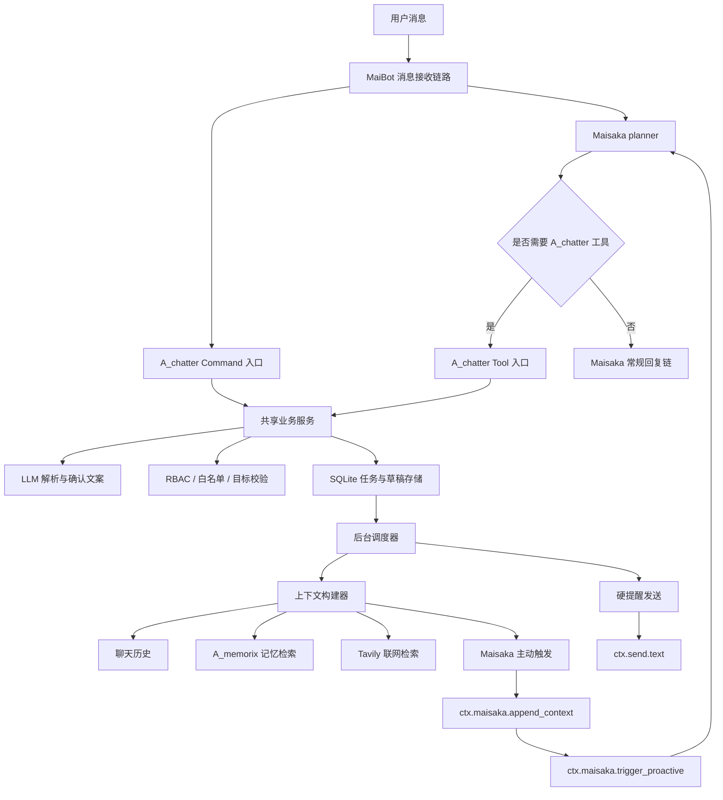
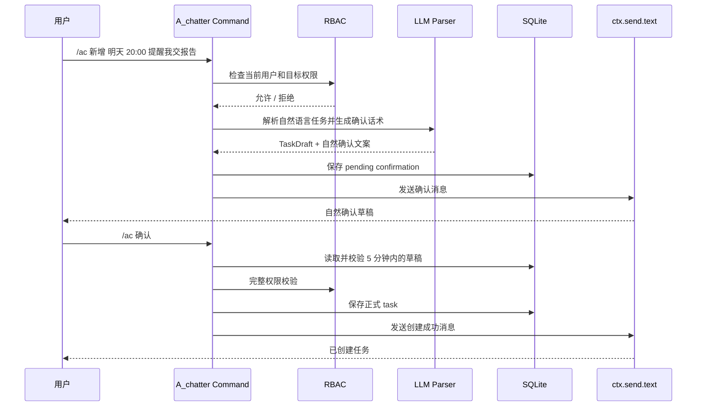
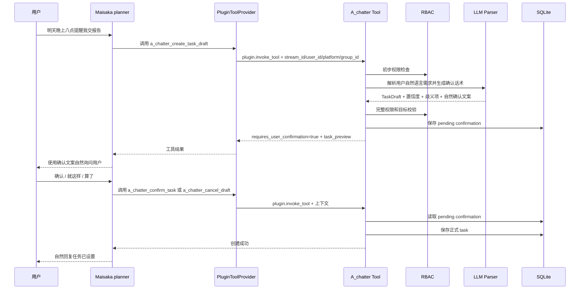
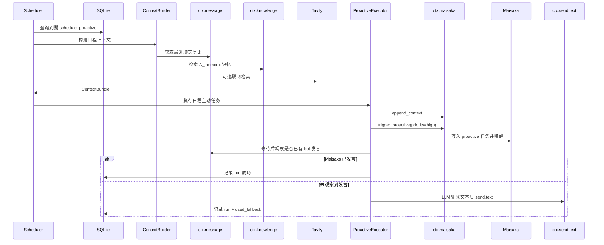
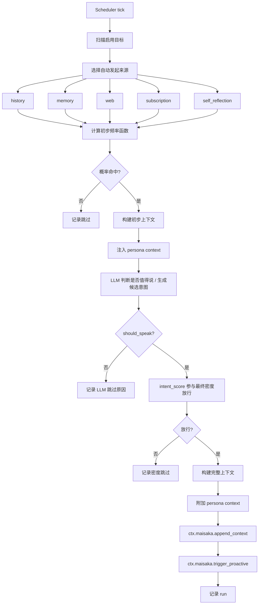
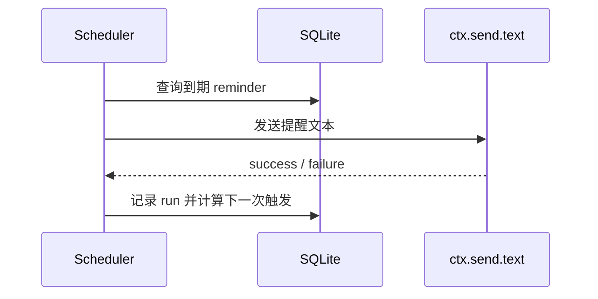

# A_chatter 消息流转图

中文名：进阶闲谈家

本文档描述 A_chatter 的主要消息和任务流转。技术实现细节见 `TECHNICAL_DESIGN.md`，产品计划见 `../../PLAN.md`。

## 总览

## 命令创建任务

用户也可以直接回复“确认”“就这样”“算了”等自然语言。该消息会在 `chat.receive.after_process` Hook 中被 A_chatter 识别；命中确认或取消后，插件发送结果并中止后续聊天主链，避免 Maisaka 再把确认消息当作普通聊天处理。

## Maisaka 自然语言工具创建任务

## 日程驱动主动发言

## 自动主动发起

说明：`persona` 是判断和生成上下文，不是普通自动发起 source。普通 source 的发起理由来自 history、memory、web、subscription 等明确锚点；`self_reflection` 是 persona-driven source，它不假设 Maisaka 常驻后台自发思考，候选意图由 A_chatter 在统一自动发起流程中生成并筛选。

## 硬提醒

## 关键约束

1. 命令入口和 Maisaka Tool 入口都必须走二次确认。
2. 命令入口和 Maisaka Tool 入口共享 pending confirmation 表。
3. 业务模块不自行计算 `session_id`，目标聊天流解析走 `ctx.chat.*`。
4. 日程驱动主动发言必须产生发言，优先 Maisaka，必要时兜底 `send.text`。
5. 自动主动发起不兜底。
6. 安静时段对日程驱动任务只影响风格，不阻止发言。
7. `self_reflection` 属于 `auto_proactive` 来源，必须复用同一套频率密度流程。
8. 当前纯插件方案不假设 Maisaka 会在后台自行产生候选意图。
9. `persona` 必须参与主动发言判断和最终输出，但普通 source 不能只靠 persona 作为发起理由。
